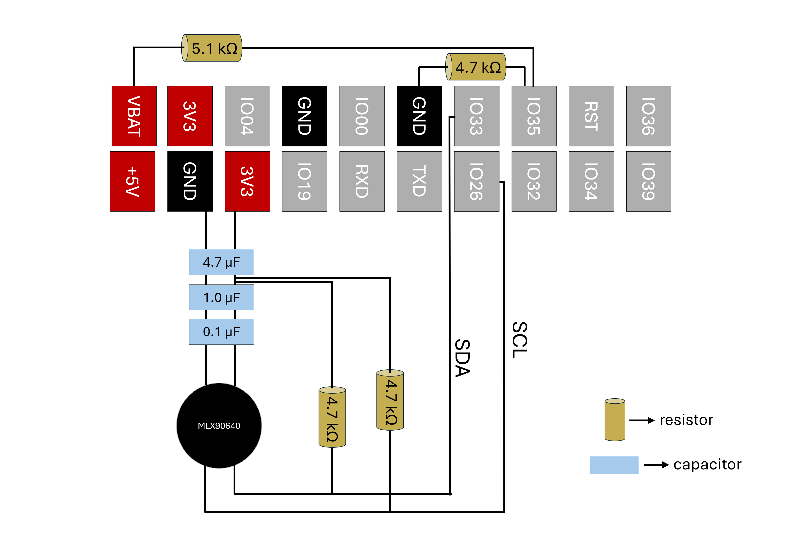

# thermal-imager
I built the DIY thermal imager designed by Ruslan Nadyrshin (rnadyrshin) and ran into a few issues that I thought I would share here. The project can be found at https://hackaday.io/project/189728-diy-pocket-thermal-imager and the firmware for version 1.1 of the device can be found at https://github.com/rnadyrshin/mlx90640_thermoimager_v1.1

I took this project on as an intro to electronics because of my intial assumption that it would be easy. In retrospect, many parts of this are easy but as a begginer, I had some fun troubleshooting parts that I could not get to work.

I purchased the lilygo ttgo t4 v1.3 (February 2025) and found that the screen would not initialize with the original code. I had to make edits to the ili9341.c file to get this to work.

Additionally, I could not get the SD card to succesfully mount so I had to make a few changes to the sd.c file as well.

Finally, as Ruslan points out, the text for the device is written in Russian so I thought I would share my python script for converting that to english. To use, save in the "main" directory and set the folder path in the python file (bottom of python code). Hopefully others find this helpful.

Here is the soldering map I made for version 1.1 of this project:

I should mention that I found I did not need the low-pass noise filter so I did not use any capacitors for my build.

I have also added a folder (OpenSCAD) that has the source code and stl files for the camera case. The design is based off of what Ruslan shared on his hackaday page. OpenSCAD is a free modeling software that is easy to download and will allow you to make any adjustments you see fit for your set up. There are files for both the 2.4 and the 2.2 inch inch display. The 2.2 inch display is preferable because it can be mounted in each corner. This 3D design should fit the perfboard style that Ruslan built. I hope some folks find this helpful!
